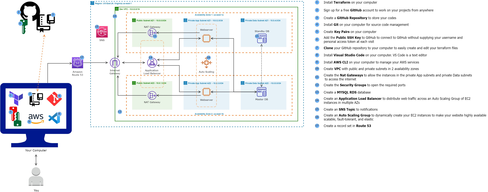

Host a Dynamic Ecommerce Website on AWS with Terraform


Sure, here's a README.md structure for your GitHub project "Host a Dynamic Ecommerce Website on AWS with Terraform". Make sure to personalize the README with any additional details and upload any scripts, diagrams, or other relevant files to your repository.

```markdown
# Host a Dynamic Ecommerce Website on AWS with Terraform

## Overview
This repository holds the Terraform configuration files used to provision a dynamic and resilient Ecommerce website on AWS. The architecture is designed for high availability across multiple Availability Zones in the AWS cloud, employing a range of services for optimal security, performance, and scalability.

## Architecture
The deployed infrastructure includes:

- **VPC** with segregated public and private subnets across two Availability Zones for fault tolerance and traffic segregation.
- **NAT Gateways** to enable outbound internet access for instances in the private subnets.
- **Security Groups** to strictly manage ingress and egress traffic according to the principle of least privilege.
- **RDS MySQL Database** instances with a master in one AZ and a standby replica in another for database high availability.
- **Elastic Load Balancer (ALB)** to distribute web traffic across an auto-scaled fleet of EC2 instances.
- **Auto Scaling Group** to dynamically adjust the number of EC2 instances, accommodating the load requirements.
- **SNS Topics** for notifications and alerts.
- **Route 53** for DNS management and routing.


## Terraform Files Structure
The Terraform configuration is organized as follows:
```
/
|-- main.tf            # Main configuration file for the Terraform setup
|-- variables.tf       # Variable declarations used in the configurations
|-- outputs.tf         # Output values after the Terraform execution
|-- ...
```

## Prerequisites
- Terraform installed on your local machine.
- AWS CLI installed and configured with appropriate permissions.
- An AWS account with sufficient privileges to create the required resources.

## Setup Instructions

1. **Initialize Terraform**:
   ```
   terraform init
   ```
2. **Plan the Terraform Deployment**:
   ```
   terraform plan
   ```
3. **Apply the Terraform Configuration**:
   ```
   terraform apply
   ```

After applying the Terraform configuration, your infrastructure will be set up in AWS, and the Ecommerce website will be accessible.

## Security Best Practices
This setup follows AWS security best practices, including:
- Strictly managed AWS IAM roles and policies.
- Security Groups with minimum necessary access.
- Encrypted data storage and transfer.

## Monitoring and Logging
- AWS CloudWatch has been configured to monitor the health and performance of the services.
- AWS CloudTrail is enabled to log and retain account activity related to actions across the AWS infrastructure.

## Contributions
Your contributions are always welcome! Please read the [CONTRIBUTING.md](CONTRIBUTING.md) file before submitting your contributions.

## License
This project is released under the MIT License. See the [LICENSE](LICENSE) file for details.

## Acknowledgements
Special thanks to the AWS community and all the developers who shared their insights and contributed to the development of this robust Ecommerce platform setup.

For any queries, feel free to reach out to me directly here on GitHub or through [my LinkedIn profile](https://www.linkedin.com/in/parin-gandhi-741156245/).
```

Remember to replace `./path-to-architecture-diagram` with the actual path to your architecture diagram within the GitHub repository. If you have any contribution guidelines, be sure to include them in a separate `CONTRIBUTING.md` file and reference them correctly. Adjust any other placeholders with the relevant information to your project.
